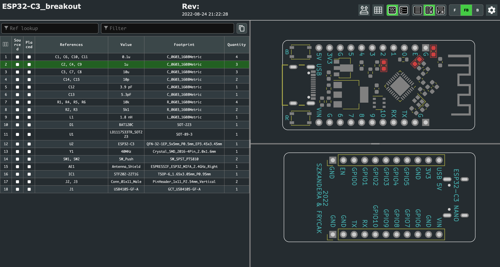

# ESP32-C3 Nano

Compact and minimalist **ESP32-C3** breakout designed in [KiCAD](https://www.kicad.org/)

## Features
- **Breadboard friendly**
- **Compact dimensions** - 46 x 21.5 mm
- **USB-C** connector for programming (using CDC, so no external usb-serial convertor)
- **External VIN pin** with schottky diode (so both VIN and USB power can be applied at the same time)
- **Low dropout regulator to 3V3** (LDO)
- **Reset** and **Boot** buttons on board
- **Integrated PCB antenna**
- **USB ESD protection**
- Chip: **ESP32-C3FH4**

## Interactive HTML BOM
Thanks to the awesome KiCAD [IBOM](https://github.com/openscopeproject/InteractiveHtmlBom) plugin, we can now generate this stunning BOM! You can find it in docs/ibom.html

## Contributors:
- **SZKANDERA Filip** (filip.szkandera@gmail.com, [@FilipSzkandera](https://github.com/FilipSzkandera/))
- **FRYČÁK Tadeáš** (frycaktadeas@seznam.cz, [@frycaktadeas](https://github.com/frycaktadeas/))
